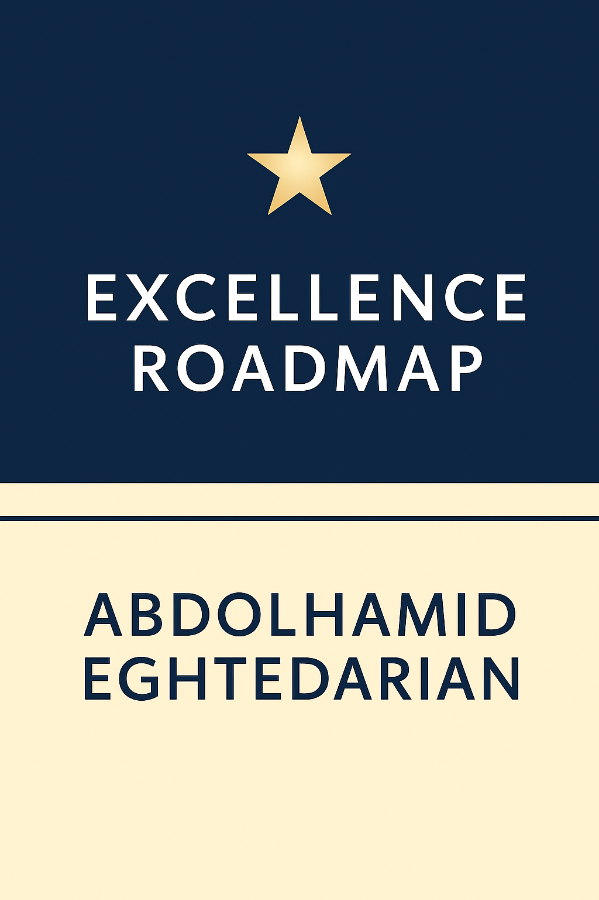
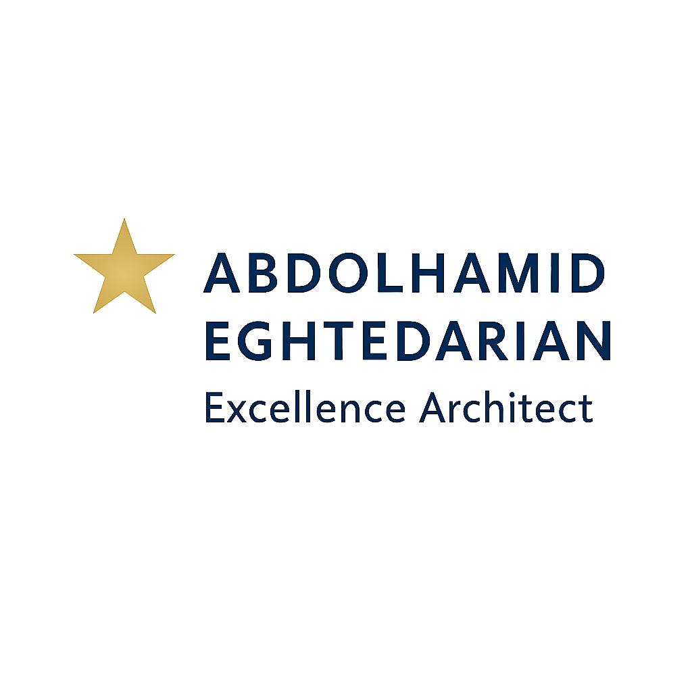

# Abdolhamid Eghtedarian  
**Excellence Architect**  
Independent senior management consultant and transformation architect, specializing in operationalizing global excellence frameworks (EFQM 2025, ISO, SDG) for mining, steel, and industrial sectors.

---

## 🔹 About Me

I design, implement, and refine strategic playbooks, SOPs, and digital tools for organizational transformation. My work is now formally branded under my full name for professional recognition.

- Expert in benchmarking, KPI development, and alignment with EFQM 2025, ISO, SDG standards  
- Fluent in English and Persian, translating global models for local implementation  
- Passionate about building reusable frameworks and empowering teams through documentation and role clarity

---

## 🔹 Featured Repository

📘 [Excellence Roadmap Repository](https://github.com/hamideghtedarian/excellence-roadmap)  
A modular archive of forms, frameworks, and tools for organizational excellence—curated and authored by Abdolhamid Eghtedarian.

---

## 🔹 Licensing

© Abdolhamid Eghtedarian – All rights reserved  
Licensed under [CC BY-NC-ND 4.0](https://creativecommons.org/licenses/by-nc-nd/4.0/)

---

